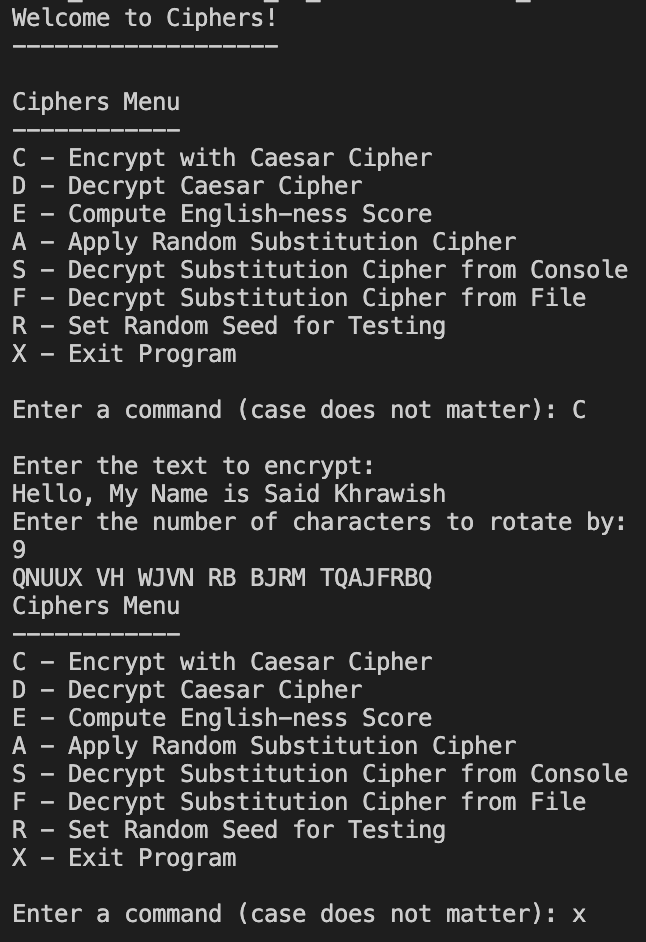

# Ciphers
UIC Project 1 - Encodes text into a cipher, vice versa, and more

(NOTE: This repository only contains the main cpp file, not the entire project)

In this project, I wrote and coded multiple functions. Some (not all) are listed here:

|Function | Description|
|----------|-------------|
| char rot  | Converts the letter into a number, wrapping if needed, references the number with ALPHABET  |
| string rot  | Converts alphabet character into uppercase, encrypts with given amount  |
| caesarEncryptCommand | Gets text to Caesar encrypt and amount to rotate, calls previous functions  |
| clean | Removes all characters that are not letters from the string and uppercases all letters  |

