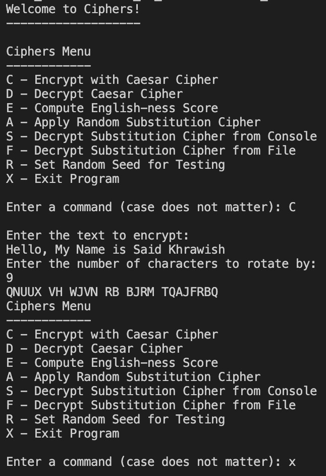

# UIC Ciphers Encryption & Decryption

(NOTE: This repository only contains the main cpp file, not the entire project)

UIC Project 1 - Encodes text into a cipher, vice versa, englishness computation, etc.

### Highlights
* Language: C++.
* Vectors
* Files, Dictionaries
* Function overloading

### Hardest and Favorite Part
The hardest part of this project was coding the computeEnglishnessCommand function where I took the words from a line and calculated the englishness of the words by chunks of 4 characters and comparing it to the dictionary. Doing so would allow the user to brute force find the decrypted text of a given cipher without knowing the shift key.

My favorite part of this project was of course the very end of it, being able to see my functions work accordingly to encrypt and decrypt very large files in a manner of minutes was very satisfying and invigorating. Reminded me why I love to code!

### Functions (Not All):

|Function | Description|
|----------|-------------|
| char rot  | Converts the letter into a number, wrapping if needed, references the number with ALPHABET  |
| string rot  | Converts alphabet character into uppercase, encrypts with given amount  |
| caesarEncryptCommand | Gets text to Caesar encrypt and amount to rotate, calls previous functions  |
| clean | Removes all characters that are not letters from the string and uppercases all letters  |

